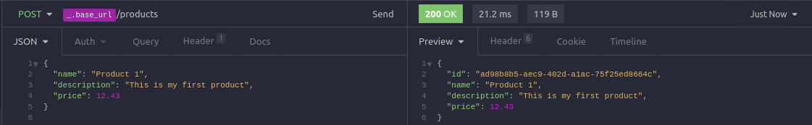
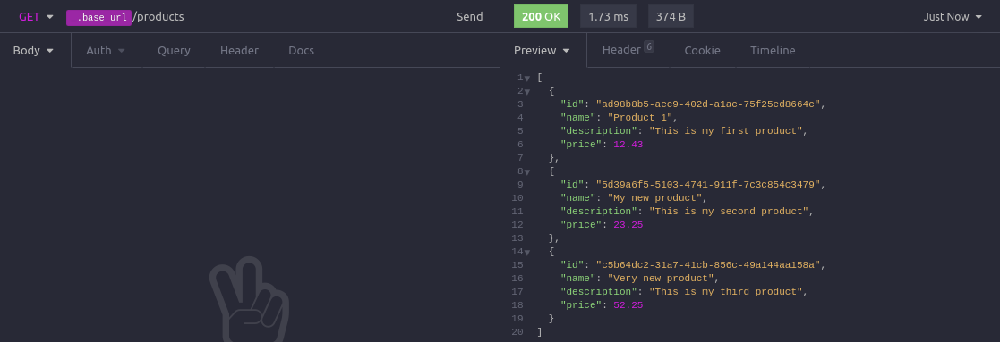
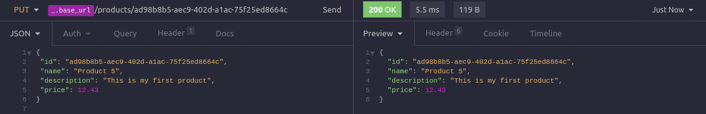

#  Simple NodeJS Project 

This is my first NodeJS project, it is a small one where I explore concepts of API, and Middlewares using [Express](https://expressjs.com/). 

## ⚡️ The Project
This project consists in a simple API with the methods GET, POST, PUT and DELETE. The data is stored in a local array, and the item that can be created using the API is an product that has a name, description and a price. 


 
 

- POST: 
    - URL: localhost:3333/products
    - Body:
        - name
        - description
        - price
 - GET: 
    - URL: [localhost:3333/products](http://localhost:3333/products)
    - Optional Query Param: 
        - name
    - Return: 
        - id 
        - name
        - description
        - price
- PUT: 
    - URL: localhost:3333/products/id
    - Body:
        - name
        - description
        - price 
    - Route Params: 
        - id
- DELETE: 
    - URL: localhost:3333/products/id
    - Route Params: 
        - id 
   
  
## 🖥️ Used Tecnologies
 - [NodeJS](https://nodejs.org/en/)
 - [ExpressJS](https://expressjs.com/)

## ⚙️ Dependencies
 - [Yarn](https://yarnpkg.com/)
 - [NodeJS](https://nodejs.org/en/)
 
## 🚀️ Getting Started

1. Clone this repository: 

```bash
git clone https://github.com/avnerjose/nodejs-simple-api-project.git
```
2. Go to the folder "nodejs-simple-api-project" you cloned and install the dependecies:

```bash
yarn
```
3. Run the development server:

```bash
yarn dev
```
4. Use the API urls with the API client app of your choice.
